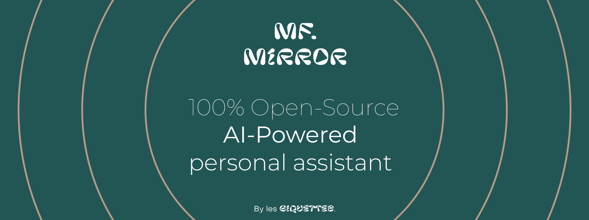

# **MFMirror**

_**By Les Biquettes**_

_"Les Biquettes" is the name of two french computer science students' band._

#

## Table of Contents
<details>
<summary>Expend in order to see</summary>

* **[Description](#description)**
* **[Installation](#installation)**
* **[Documentation](#docs)**

</details>


### Description
Don't have any friends? Better than a curly: MFMirror!

MFMirror is an artificial intelligence based on Llama, created by the Biquettes. It powers the world's best mirror. You might ask: If I had to sum up MFMirror with you today, I'd start by saying that it's a meeting between two brilliant minds who reached out to each other, perhaps at a time when we couldn't take it anymore, when we were alone at home. And it's quite curious to think that this chance meeting forged a most perfect mirror, because when you have this taste for things well done, the beautiful gesture, well I'd say that you don't find the interest in spying on your customers as our competitors Amazon, Google or even Apple do.

So, as you may have gathered, Les Biquettes today present a project born of a meeting between the most eminent minds in science fiction and those of the Brothers Grimm.

A seemingly simple object of fascination, the mirror is in fact a marvellous instrument that has captivated people's imaginations for centuries, possessing a mystical aura that is both practical and magical, making it unique among everyday objects. Here's to artificial intelligence, which we've been talking about far too much lately.

MFMirror is a mirror prototype based on the AI concept of the famous fictional character Tony Stark, a.k.a. Iron Man, or Gideon, the AI of Barry Allen, a.k.a. Flash. A generative AI based on Llama, coupled with voice synthesis, will provide a companion, and control home automation without fear of data leakage. Facial recognition will give the user a feeling of proximity. With no keyboard, mouse or other peripherals, the mirror could be controlled by voice or hand gestures. It would display what you ask it to, thanks to a retrieval screen; it would be battery-powered and in standby it would display the time, the weather and could manage your music from the Internet or stored locally. Finally, using proprietary software, it could manage your schedule, timer and much more without using third-party services. The camera would not be connected to the Internet at all, to avoid spyware.


Les Biquettes make it a point of honour to keep your personal information secure (really!), and 99% of the information needed for the device to function properly would be stored locally, safe from rogue advertisers and pirates.

#

## Installation

1. Debian based os
   - Fork and clone this repo
   - At the root of the project, run `pip install -r requirements.txt` :<details><summary>List of dependencies used in this project</summary>
     - tkinter with customtkinter
     - numpy
     - imutils
     - pickle
     - sklearn
     - threading
     - mediapipe
     - pygame
     - IO
     - moviepy
     - pytube
     - google apis
     - json
     - pyttsx3
     - wikipedia
     - webbrowser
     - shutil
     - speechrecognition
     
     **You will need pyaudio for this project. It's a bit complicated so you may have to search on the web to install it properly :**
      ```shell
        sudo apt-get install python-pyaudio
      ```
   
    </details>
      
   - And you are **done** ! You can use this project **as you want**, edit it **as you want** and if you want to help us, open issues and pull requests to make it **grow** :)
     

## Documentation
Folder Structure :
```
  .
  ├── build                   # Compiled files (alternatively `dist`)
  |
  ├── src                     # Source files (alternatively `app`)
  |     └── features          # Here are the face detection, hand gesture, music scripts and so on...
  |     └── components        # Components used in the UI
  |     └── interface.        # User Interface itself
  |
  ├── tools                   # Tools and utilities
  |     └── DeveloperUI.py   # This is the UI used to test every feature individually
  |
  ├── Explainations           # Here you'll find explanations on features and READMEs assets.
  |     └── Assets
  |     └── Face-recognition.md
  |     └── Hand-gesture.md
  |     └── Music.md
  |
  ├── DATA                    # This folder stores datasets as faces and musics
  |
  ├── LICENSE
  └── README.md               # You are here !
  ```
#### [How face recognition works ?](./Explainations/Face-recognition.md)
#### [How hand gesture detection works ?](./Explainations/Hand-gesture.md)
#### [How the music is played ?](./Explainations/Music.md)


## Authors

- [@A.weirdwhale](https://www.github.com/aweirdwhale)
- [@Baziog](https://www.github.com/Baziog)

## Appendix

This project is under MIT licence, free for everyone and forever !

[](https://choosealicense.com/licenses/mit/)

Fonts used in the UI : [Pilowlava](https://www.freefaces.gallery/typefaces/pilowlava) & [Subjectivity](https://www.freefaces.gallery/typefaces/subjectivity)


## Software :

    

## Hardware :

  